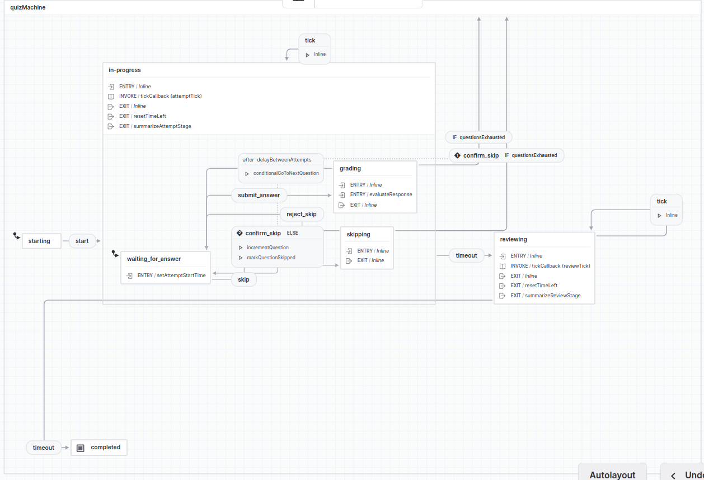

# xstate-quiz-machine

Experiments with XState to build a Svelte Library of a student learning experience and data capture system.

# Getting Started

## Prerequisites

- Node.js
- pnpm

## Installation

```bash
$ git clone https://github.com/oele-isis-vanderbilt/xstate-quiz-machine.git
$ cd xstate-quiz-machine
$ pnpm install
```

## Demo Application

To run the demo application, execute the following command:

```bash
$ pnpm dev
```

This will start a local development server, and you can access the application at `http://localhost:5173`.

## The Quiz Machine

The quiz machine is a state machine that manages the flow of a quiz experience. It has the following states and substates(Better suited for a diagram):


## To Do

- [ ] Testing
- [ ] Documentation
- [ ] Integration with the problem creation tool in [Betty's Math](https://github.com/oele-isis-vanderbilt/problem-creation-tool)
